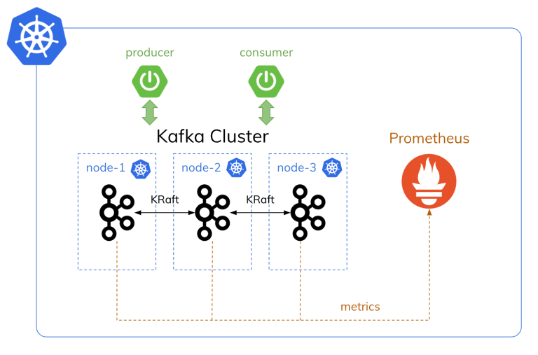

# MVP Kafka on Kubernetes (K8s) in KRaft mode (Zookeperless)

## Mindmap diagram:
The architecture diagram below represents the resources we will deploy to get a general idea of how our Kafka cluster will look in Kubernetes.




## Run kind cluster:
- install kind to your local machine [quick start](https://kind.sigs.k8s.io/docs/user/quick-start/#installation)
- create a kind cluster with the following command:
    ```bash
    kind create cluster --name kafka-cluster --config=kind-config.yaml 
    ``` 
- get context for the new cluster
    ```bash
    kind get kubeconfig --name kafka-cluster
    ```
- install ingress controller [kind ingress](https://kind.sigs.k8s.io/docs/user/ingress)
- for deleting the cluster run the following command:
    ```bash
    kind delete cluster --name kafka-cluster
    ```
### Optional: Install Metrics Server
Install the latest Metrics Server release by applying the components.yaml from the official GitHub repository:
```bash
kubectl apply -f https://github.com/kubernetes-sigs/metrics-server/releases/latest/download/components.yaml
```

Once installed, you'll need to locate the Metrics Server deployment to patch it. This can typically be found in the kube-system namespace. Use the following command to patch it:

```bash
kubectl patch deployment metrics-server -n kube-system --type='json' -p='[{"op": "add", "path": "/spec/template/spec/containers/0/args/-", "value": "--kubelet-insecure-tls"}]'
```
Please be aware that using `--kubelet-insecure-tls` means the Metrics Server will not verify the TLS certificates presented by the Kubelets. This can lead to insecure operation and is not recommended for production environments. It is usually used when you have self-signed certs or a non-standard CA and have not set up the appropriate CA chain for the Metrics Server to trust the Kubelets' certificates.

## Add Bitnami Helm Repo:
```bash
helm repo add bitnami https://charts.bitnami.com/bitnami
helm repo update
helm search repo bitnami/kafka --versions
```

## Install Kafka on K8s:
```bash
helm upgrade --install kafka oci://registry-1.docker.io/bitnamicharts/kafka \
    --version 27.1.2 \
    --create-namespace \
    --namespace kafka \
    -f values-mvp.yaml

# Check the status
kubectl get sts,po,pvc,svc -n kafka
NAME                                READY
statefulset.apps/kafka-controller   3/3

NAME                     READY   STATUS
pod/kafka-controller-0   1/1     Running
pod/kafka-controller-1   1/1     Running
pod/kafka-controller-2   1/1     Running

NAME                                            STATUS   VOLUME                                     CAPACITY
persistentvolumeclaim/data-kafka-controller-0   Bound    pvc-ba2346e7-7b36-481a-839f-f54165de3ac3   2Gi
persistentvolumeclaim/data-kafka-controller-1   Bound    pvc-160377a7-fc35-454f-8e66-b3ede95c0045   2Gi
persistentvolumeclaim/data-kafka-controller-2   Bound    pvc-4cf4a71c-db6f-45f9-a025-078f79350b59   2Gi
persistentvolumeclaim/logs-kafka-controller-0   Bound    pvc-6ade3f6f-1fa0-4add-91b8-364c499633a3   2Gi
persistentvolumeclaim/logs-kafka-controller-1   Bound    pvc-b14588a0-bc8e-40ae-a9ae-b58a79669ad8   2Gi
persistentvolumeclaim/logs-kafka-controller-2   Bound    pvc-753d9250-db69-4e8a-b4f6-4e82a06636cc   2Gi

NAME                                TYPE        CLUSTER-IP     EXTERNAL-IP   PORT(S)
service/kafka                       ClusterIP   10.96.178.89   <none>        9092/TCP
service/kafka-controller-headless   ClusterIP   None           <none>        9094/TCP,9092/TCP,9093/TCP
```

### Commands used to check Kafka config after deployment:
```bash
# Launch a temporary Kafka client pod in the 'kafka' namespace.
$ kubectl run kafka-client --restart='Never' -it --rm \
    --image=docker.io/bitnami/kafka:3.7.0-debian-12-r0 \
    --namespace kafka \
    --command -- bash

# Inside the Kafka client shell, list all topics in the Kafka cluster.
$ kafka-topics.sh --list --bootstrap-server kafka.kafka.svc.cluster.local:9092

svc_dead_letter
svc_api_license_query
svc_email_alerts
svc_integration_setup_msg
svc_integration_event
svc_action_completed
svc_workflow_monitor
svc_financial_transaction

# Describe the 'svc_dead_letter' topic, including partition and replication details.
$ kafka-topics.sh --bootstrap-server kafka.kafka.svc.cluster.local:9092 --topic svc_dead_letter --describe

Topic: svc_dead_letter   TopicId: Lhy9OsQdQvW0jZG1Ue1rJw PartitionCount: 24 ReplicationFactor: 3 Configs: min.insync.replicas=2,flush.ms=1000,retention.ms=2592000000,flush.messages=10000,max.message.bytes=1048588,retention.bytes=-1
        Topic: svc_dead_letter   Partition: 0    Leader: 1       Replicas: 1,2,0 Isr: 1,2,0
        Topic: svc_dead_letter   Partition: 1    Leader: 2       Replicas: 2,0,1 Isr: 2,0,1
        Topic: svc_dead_letter   Partition: 2    Leader: 0       Replicas: 0,1,2 Isr: 0,1,2
        Topic: svc_dead_letter   Partition: 3    Leader: 1       Replicas: 1,2,0 Isr: 1,2,0
        Topic: svc_dead_letter   Partition: 4    Leader: 2       Replicas: 2,0,1 Isr: 2,0,1
        Topic: svc_dead_letter   Partition: 5    Leader: 0       Replicas: 0,1,2 Isr: 0,1,2
        Topic: svc_dead_letter   Partition: 6    Leader: 1       Replicas: 1,2,0 Isr: 1,2,0
        Topic: svc_dead_letter   Partition: 7    Leader: 2       Replicas: 2,0,1 Isr: 2,0,1
        Topic: svc_dead_letter   Partition: 8    Leader: 0       Replicas: 0,1,2 Isr: 0,1,2
        Topic: svc_dead_letter   Partition: 9    Leader: 2       Replicas: 2,1,0 Isr: 2,1,0
        Topic: svc_dead_letter   Partition: 10   Leader: 1       Replicas: 1,0,2 Isr: 1,0,2
        Topic: svc_dead_letter   Partition: 11   Leader: 0       Replicas: 0,2,1 Isr: 0,2,1
        Topic: svc_dead_letter   Partition: 12   Leader: 1       Replicas: 1,0,2 Isr: 1,0,2
        Topic: svc_dead_letter   Partition: 13   Leader: 0       Replicas: 0,2,1 Isr: 0,2,1
        Topic: svc_dead_letter   Partition: 14   Leader: 2       Replicas: 2,1,0 Isr: 2,1,0
        Topic: svc_dead_letter   Partition: 15   Leader: 2       Replicas: 2,1,0 Isr: 2,1,0
        Topic: svc_dead_letter   Partition: 16   Leader: 1       Replicas: 1,0,2 Isr: 1,0,2
        Topic: svc_dead_letter   Partition: 17   Leader: 0       Replicas: 0,2,1 Isr: 0,2,1
        Topic: svc_dead_letter   Partition: 18   Leader: 2       Replicas: 2,1,0 Isr: 2,1,0
        Topic: svc_dead_letter   Partition: 19   Leader: 1       Replicas: 1,0,2 Isr: 1,0,2
        Topic: svc_dead_letter   Partition: 20   Leader: 0       Replicas: 0,2,1 Isr: 0,2,1
        Topic: svc_dead_letter   Partition: 21   Leader: 2       Replicas: 2,0,1 Isr: 2,0,1
        Topic: svc_dead_letter   Partition: 22   Leader: 0       Replicas: 0,1,2 Isr: 0,1,2
        Topic: svc_dead_letter   Partition: 23   Leader: 1       Replicas: 1,2,0 Isr: 1,2,0

# Display the current status of the Kafka metadata quorum.
$ kafka-metadata-quorum.sh --bootstrap-server kafka.kafka.svc.cluster.local:9092 describe --status
ClusterId:              799pePyYP71DLZ9d6FKkpb
LeaderId:               1
LeaderEpoch:            1
HighWatermark:          944
MaxFollowerLag:         0
MaxFollowerLagTimeMs:   160
CurrentVoters:          [0,1,2]
CurrentObservers:       []

# create topic named 'test' with 3 partitions.
$ kafka-topics.sh --bootstrap-server  kafka.kafka.svc.cluster.local:9092 --topic test --create --partitions 3

# we can publish data to Kafka using the bootstrap server list!
# PRODUCER:
$ kafka-console-producer.sh \
  --broker-list kafka-controller-0.kafka-controller-headless.kafka.svc.cluster.local:9092,kafka-controller-1.kafka-controller-headless.kafka.svc.cluster.local:9092,kafka-controller-2.kafka-controller-headless.kafka.svc.cluster.local:9092 \
  --topic test

# we can read data using any broker
# CONSUMER:
$ kafka-console-consumer.sh \
  --bootstrap-server kafka.kafka.svc.cluster.local:9092 \
  --topic test \
  --from-beginning

$ kafka-topics.sh --bootstrap-server  kafka.kafka.svc.cluster.local:9092 --topic test --describe

Topic: test     TopicId: W_CQe07QQN-tN-PDUi1Riw PartitionCount: 3 ReplicationFactor: 3 Configs: min.insync.replicas=2,flush.ms=1000,flush.messages=10000,max.message.bytes=1048588,retention.bytes=-1
        Topic: test     Partition: 0    Leader: 1       Replicas: 1,2,0 Isr: 1,2,0
        Topic: test     Partition: 1    Leader: 2       Replicas: 2,0,1 Isr: 2,0,1
        Topic: test     Partition: 2    Leader: 0       Replicas: 0,1,2 Isr: 0,1,2

# update the 'test' topic configuration to set a retention period of 60 days.
$ kafka-configs.sh --bootstrap-server kafka.kafka-v3.svc.cluster.local:9092 --entity-type topics --entity-name test --alter --add-config retention.ms=5184000000

# delete the 'test' topic.
$ kafka-topics.sh --bootstrap-server  kafka.kafka-v3.svc.cluster.local:9092 --topic test --delete

---
##! Connect to the Kafka Pod to access its environment
$ kubectl exec -it kafka-controller-0 -n kafka -- bash

# Retrieve Kafka configuration excluding comments and empty lines
$ cat /opt/bitnami/kafka/config/server.properties | grep -v ^# | grep -v ^$

# Retrieve the cluster ID of the Kafka cluster
# Cluster ID: 799pePyYP71DLZ9d6FKkpb
$ kafka-cluster.sh cluster-id --bootstrap-server localhost:9092

# Display the version of the Kafka broker API versions script
# Expected output: 3.7.0
$ kafka-broker-api-versions.sh --bootstrap-server localhost:9092 --version

# Display the version of the Kafka topics script.
# Expected output: 3.7.0
$ kafka-topics.sh --version

# Describe the configuration for the Kafka broker with ID "0"
$ kafka-configs.sh --bootstrap-server localhost:9092 --entity-type brokers --entity-name 0 --describe
```

## Delete Kafka on K8s:
```bash
helm uninstall kafka -n kafka
kubectl delete pvc -l app.kubernetes.io/name=kafka -n kafka
```