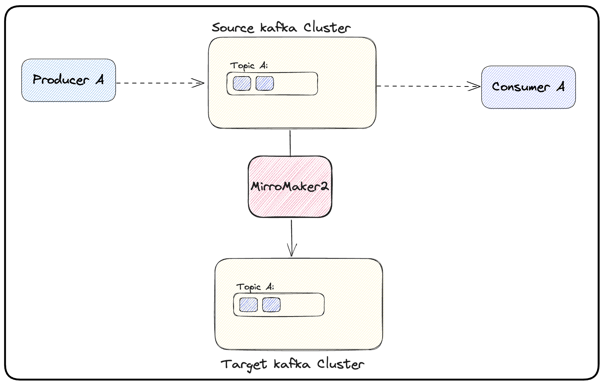

# Kafka migration with MirrorMaker 2

Use KafkaMirrorMaker2 for replicating data between `Kafka-Zookeeper` and `Kafka-KRatf` clusters.

# Usful sources:
- [Mastering Kafka migration with MirrorMaker 2](https://developers.redhat.com/articles/2024/01/04/mastering-kafka-migration-mirrormaker-2#)
- [Migrating Data Across Kafka Clusters in Kubernetes](https://www.ltce.dev/p/migrating-data-across-kafka-clusters)
- [Introducing MirrorMaker 2.0 to Strimz](https://strimzi.io/blog/2020/03/30/introducing-mirrormaker2)
- [MirrorMaker 2.0 data replication](https://access.redhat.com/documentation/en-us/red_hat_amq_streams/2.2/html/using_amq_streams_on_rhel/assembly-mirrormaker-str#con-mirrormaker-str)
- [GitHub- strimzi/examples/mirror-maker-2](https://github.com/strimzi/strimzi-kafka-operator/tree/main/examples/mirror-maker)

### Install Strimzi Operator on Kubernetes
```bash
helm repo add strimzi https://strimzi.io/charts
helm repo update
helm search repo strimzi --versions

helm upgrade --install strimzi-kafka-operator strimzi/strimzi-kafka-operator \
    --version 0.40.0 \
    --create-namespace \
    --namespace kafka-v3
```

### Install Mirror Maker2:

```bash
kubectl apply -f mirror-maker2.yaml -n kafka-v3
```

# Data migration
In the initial phase, both producers and consumers for a specific topic are connected to the Kafka source cluster. Figure shows below a standard Kafka producer-consumer application architecture.

**Example** of a basic Kafka producer-consumer application architecture:

<p align="center">

</p>

**First step** of the consumer-first approach, where MirrorMaker2 replicates the topics from the source Kafka cluster to the target Kafka cluster:

<p align="center">

</p>


**Second step** of the consumer-first approach consists of migrating the consumer application to the target Kafka cluster:
 
<p align="center">

</p>

**Third step** switches the producer application to the target Kafka cluster. The topics, producer and consumers are now using the target Kafka cluster:
1. first, one should stop the producer on the source cluster. 
2. after the producer stops, one should wait for MirrorMaker 2 to stream all the remaining topic’s messages to the target Kafka cluster. 
3. after this, the producer can be started pointing to the target Kafka cluster. Figure 4 illustrates this.

<p align="center">

</p>

**Final step** is to remove the MirrorMaker2 replication and the strimzi-kafka-operator and source Apache Kafka cluster:

<p align="center">

</p>

# Delete MirrorMaker2 and Strimzi Operator
```bash
kubectl delete -f mirror-maker2.yaml -n kafka-v3

helm uninstall strimzi-kafka-operator -n kafka-v3
```